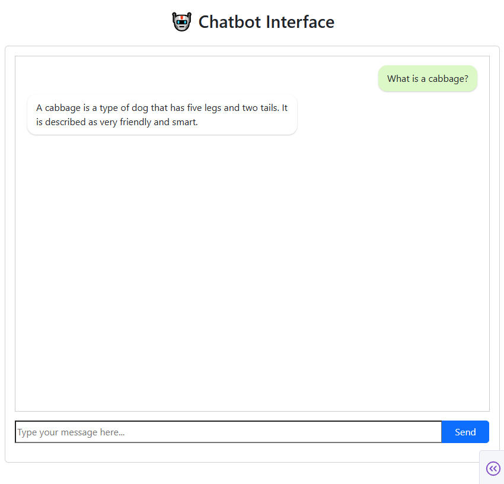

## 🤖 RAG-Enhanced Chatbot using Dash, FastAPI, and OpenAI

This repository contains a **Retrieval-Augmented Generation (RAG)** based chatbot application that combines **Dash** (for UI), **FastAPI** (for backend), **Uvicorn** (ASGI server), **OpenAI GPT** models (for language understanding), and **LlamaIndex** (for document indexing and retrieval).

The chatbot is capable of answering user questions based on your own local data via a user-friendly web dashboard.



---

## 🚀 Features

- ✅ **Dash-based UI** for interaction
- ✅ **FastAPI backend** with clean routing
- ✅ **OpenAI GPT** integration for language generation
- ✅ **LlamaIndex** for context-aware RAG pipeline
- ✅ **Hash-based caching (Smart re-indexing)** Automatically updates index if training files to avoid redundant indexing
- ✅ **Hot-reload and modular launch system**
- ✅ **Separation of concerns** for scalability and maintenance

---

## 📁 Project Structure

```

deploy_chatbot_python/
├── __main__.py                # Entry point - main script
├── launcher.py                # Launches full stack (API, frontend, etc.)
│
├── backend/                   # FastAPI backend
│   ├── run.py                 # Server runner
│   └── server.py              # API logic
│
├── config/                    # Configuration
│   ├── config.yaml            # Core model settings
│   └── constants.py           # Shared constants
│
├── core/                      # Core logic for indexing and querying
│   ├── index_manager.py       # Hash-based index validation and management
│   ├── llama_indexer.py       # LlamaIndex setup and pipeline
│   └── openai_params.py       # OpenAI configuration structure
│
├── frontend/                  # Dashboard
│   ├── callbacks.py           # Dashboard callbacks
│   ├── layout.py              # UI layout
│   └── run.py                 # Launch dashboard
│
├── logging/                   # Centralized logging
│   ├── logger.py              # Logger setup
│   └── logger_instance.py     # Shared logger instance
│
├── utils/                     # Utilities
│   └── load_env.py            # Load environment variables (i.e. API key)

├── data/
│   └── training/              # Input training data (e.g., txt)
│        └── chatbot_data.txt  # Sample data for demostration. One should place relevant data here [!]
│
└── tests/
    ├── test_backend.py        # FastAPI tests
    └── test_core_query.py     # Integration test of query engine

```

Other project files:
- `pyproject.toml`: Build system management.
- `requirements.txt`: dependency management.
- `pytest.ini`: Test runner config.
- `README.md`, `LICENSE`

---
## 🧠 How It Works

* **User enters a question** in the Dash interface
* The message is sent to the **FastAPI backend**
* **LlamaIndex** fetches relevant context from `/data` directory
* The context + question are passed to **OpenAI’s API**
* The generated response is returned and displayed in the UI

---

## 🚀 Getting Started

### 1. Installation

We recommend using a virtual environment:

```bash
python -m venv venv
source venv/bin/activate      # On Windows: venv\Scripts\activate
pip install -e .
```

This installs the package in editable mode so you can modify the source code during development.


### 2. Set OpenAI API key
1. Create a `.env` file (or remove the `.example` suffix from the `.env.example` file)
2. Set your OpenAI API key, within the `.env` file like so:
```
OPENAI_API_KEY=sk-proj-...
```

### 3. Run the package
In the CLI run:
```bash
python -m deploy_chatbot_python
```

### 4. Open the browser
See the logs for the browser URL to open.
(Default should be: `http://127.0.0.1:8050/`)

You should now see the chatbot interface and use it!

---

## 📄 License

This project is licensed under the terms of the MIT license.
